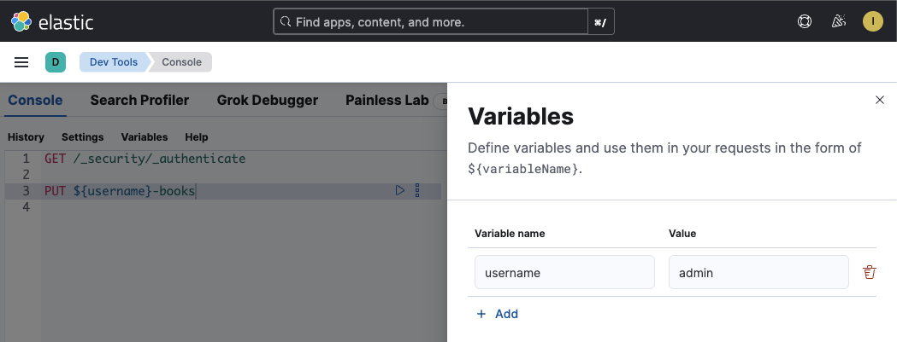

# Lab 0: Setting Up Your Username Variable

## Overview

Since multiple users will be sharing the same Elasticsearch cluster, we need to ensure that each user creates uniquely named indices to avoid conflicts. This lab will show you how to set up a username variable in Kibana DevTools console.

## Step 1: Define your username variable in DevTools console

Kibana DevTools console supports variables. At the **very top** of your DevTools Console session, open the variables section:



## Step 2: Using the Variable in Commands

Once defined, you can reference your username variable using `${username}` syntax in all your commands:

**Example:**

```
# Create an index with your username prefix
PUT /${username}-books

# Add data to your index
POST /${username}-books/_bulk
{"index": { "_id": 1}}
{"id": 1, "title": "The Hobbit"}

# Search your index
GET /${username}-books/_search

# Delete your index
DELETE /${username}-books
```

## Step 3: Verification

Test your setup:

```
# At the top of your console:
username = kibana_user1

# Create a test index
PUT /${username}-test
{
  "settings": {
    "number_of_shards": 1
  }
}

# Verify it was created
GET /_cat/indices/${username}-*?v

# Clean up
DELETE /${username}-test
```

If you see your index created with your username prefix (e.g., `kibana_user1-test`), you're all set!

## Using the helper script for JSON bodies

If you prefer using `curl` commands or if variable substitution doesn't work in your Kibana version, you can use the provided Python helper script to replace `${username}` in JSON files.

### Using replace_username.py

The `replace_username.py` script reads a JSON file, validates its syntax, replaces all `${username}` occurrences, and creates a new file with `_replaced` suffix.

**Example:**

1. Create a JSON file with `${username}` placeholders (e.g., `query.json`):

```json
{
  "index": "${username}-books",
  "shard": 0,
  "primary": false
}
```

2. Run the script:

```bash
python replace_username.py -f query.json -u kibana_user1
```

3. This creates `query_replaced.json`:

```json
{
  "index": "kibana_user1-books",
  "shard": 0,
  "primary": false
}
```
