# Setup Elasticsearch and Kibana on IBM Cloud

## Architecture



## Create Database for Elasticsearch service

Create an instance of this service: [https://cloud.ibm.com/databases/databases-for-elasticsearch/create](https://cloud.ibm.com/databases/databases-for-elasticsearch/create)

## Deploy Kibana on IBM Code Engine

Use the following instructions to deploy Kibana as a container on IBM Code Engine:<br />
[https://cloud.ibm.com/docs/databases-for-elasticsearch?topic=databases-for-elasticsearch-kibana-code-engine-icd-elasticsearch](https://cloud.ibm.com/docs/databases-for-elasticsearch?topic=databases-for-elasticsearch-kibana-code-engine-icd-elasticsearch)

## Add users to Kibana

Two Ansible roles are provided to manage Kibana users against an IBM Cloud Databases for Elasticsearch cluster:

| Role | Purpose |
|------|---------|
| [`ansible-roles/kibana-users`](ansible-roles/kibana-users/) | Creates numbered Kibana users with developer permissions |
| [`ansible-roles/kibana-users-cleanup`](ansible-roles/kibana-users-cleanup/) | Removes those users and the associated custom role |

### Optional: Create virtual environment

```bash
python3 -m venv ansible-env
source ansible-env/bin/activate  # On Windows: ansible-env\Scripts\activate
pip install ansible
```

### Configure connection details

Edit [`ansible-roles/kibana-users/defaults/main.yml`](ansible-roles/kibana-users/defaults/main.yml) with your cluster's connection details:

```yaml
elasticsearch_host: "<your-hostname>.databases.appdomain.cloud"
elasticsearch_port: <port>
elasticsearch_protocol: "https"
elasticsearch_admin_user: "<your-admin-user>"
elasticsearch_admin_password: "{{ lookup('env', 'ES_ADMIN_PASSWORD') }}"
```

The admin password is read from the `ES_ADMIN_PASSWORD` environment variable to avoid storing credentials in plain text:

```bash
export ES_ADMIN_PASSWORD="your-admin-password"
```

### Optional: Customise user settings

The following variables in [`ansible-roles/kibana-users/defaults/main.yml`](ansible-roles/kibana-users/defaults/main.yml) control how users are created:

```yaml
# Number of users to create
kibana_users_count: 20

# Users will be named kibana_user1, kibana_user2, …
kibana_user_prefix: "kibana_user"

# Initial password — users should change this on first login
kibana_user_default_password: "ChangeMe123!"

# Custom role assigned to each user
kibana_user_role_name: "kibana_developer"
```

### Create users

Run the provided playbook from the `setup_ibm-cloud` directory:

```bash
ansible-playbook playbook-create.yml
```

On success, Ansible prints a summary of the created users:

```
"=========================================="
"IBM Cloud Kibana Access Information"
"=========================================="
"Users created: 20"
"Username pattern: kibana_user[1-20]"
"Default password: ChangeMe123!"
"=========================================="
"IMPORTANT: Users should change their password on first login!"
"=========================================="
```

### Delete users

To remove all users and the custom role created above, run:

```bash
ansible-playbook playbook-delete.yml
```

The cleanup role will discover every user matching `kibana_user_prefix`, prompt for confirmation, then delete the users and the `kibana_developer` role. To skip the confirmation prompt, pass the variable on the command line:

```bash
ansible-playbook playbook-delete.yml -e "confirm_deletion=false"
```
